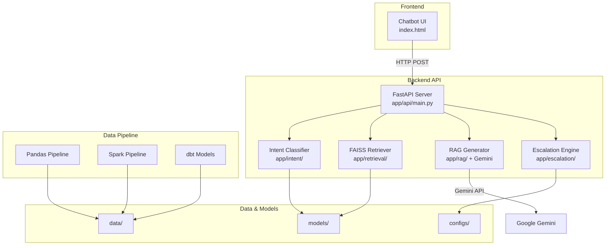
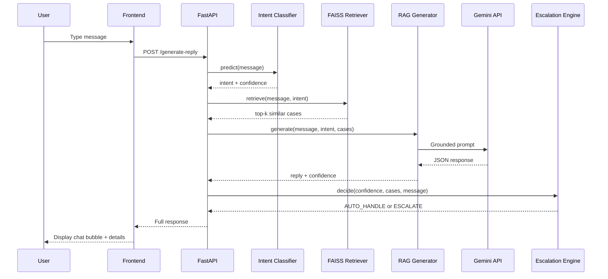

# Architecture Overview

## System Architecture

## Request Flow

## Key Components

| Component | Location | Purpose |
|-----------|----------|---------|
| Intent Classifier | `backend/app/intent/` | TF-IDF + LogReg / Sentence Transformers |
| FAISS Retriever | `backend/app/retrieval/` | Semantic search over historical cases |
| RAG Generator | `backend/app/rag/` | Gemini-powered grounded response generation |
| Escalation Engine | `backend/app/escalation/` | Strict priority-based escalation decisions |
| Data Pipelines | `backend/app/pipelines/` | Pandas (small) and Spark (large) processing |
| Evaluation | `backend/app/evaluation/` | Metrics, baselines, LLM judge |
